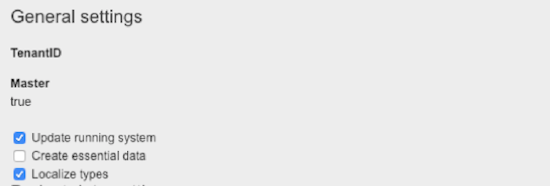
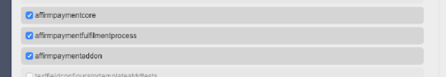
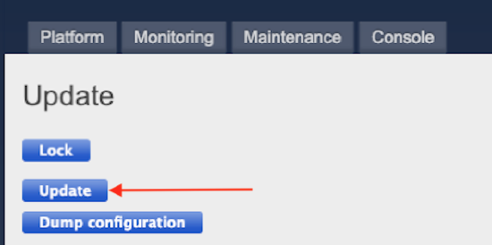
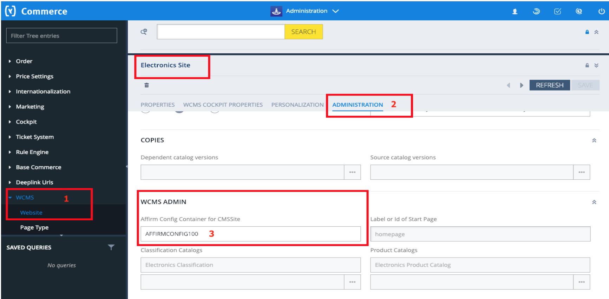
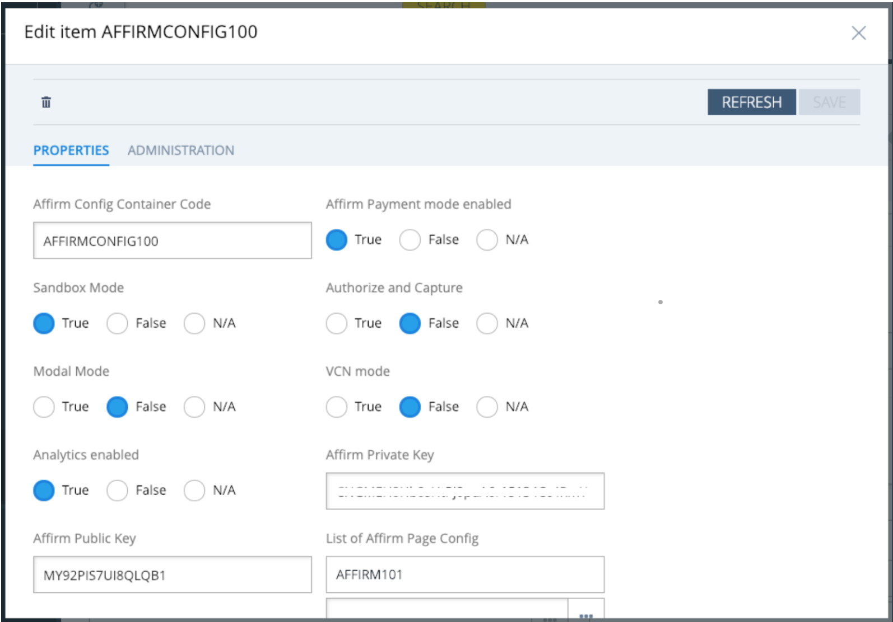
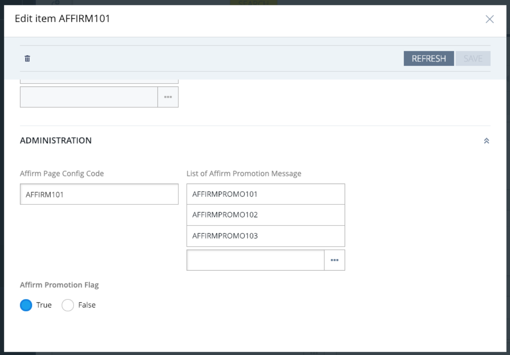
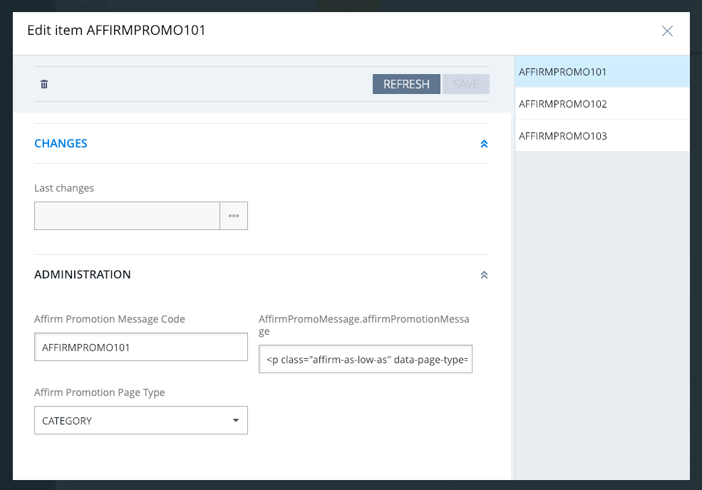
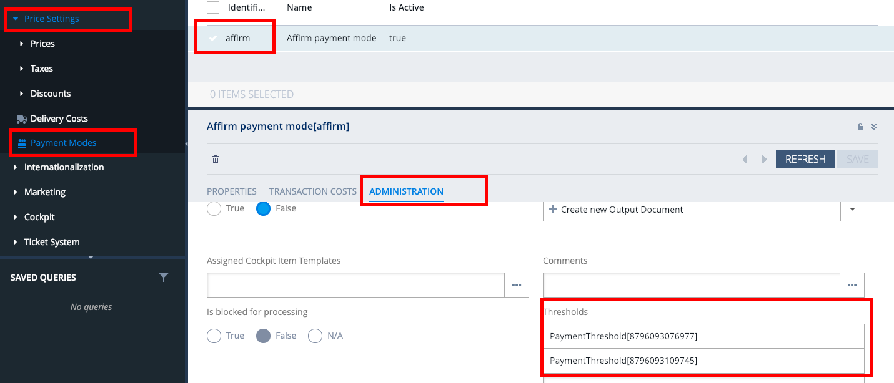
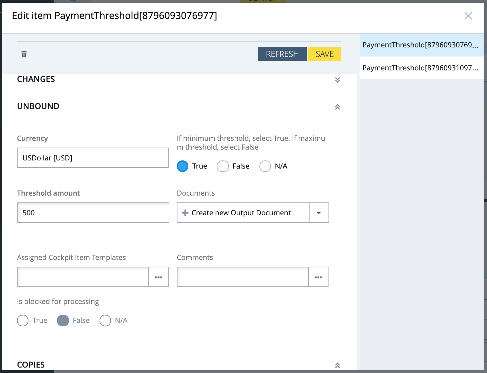
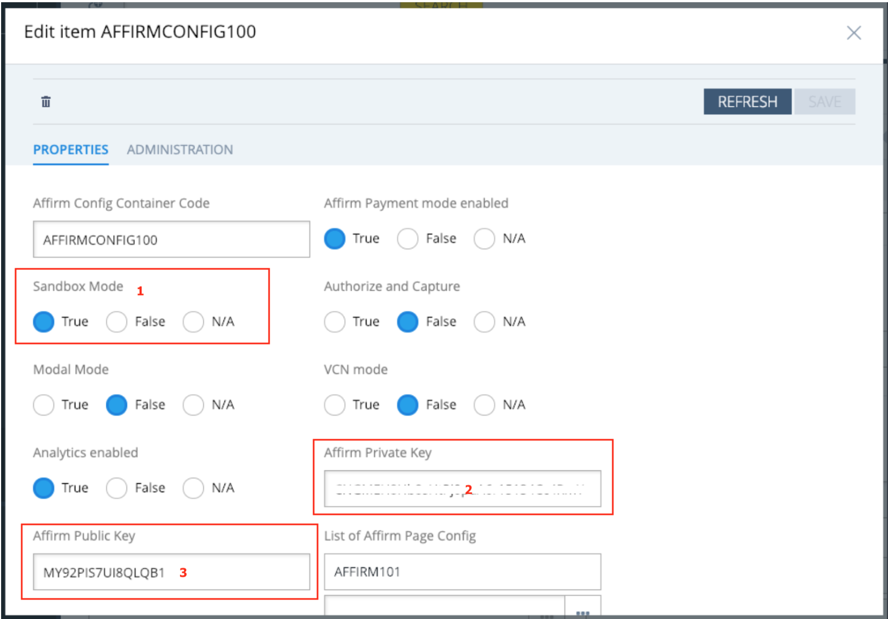

Affirm Hybris Extension
----------------------------

**Overview**

This guide describes how to integrate Affirm into your Hybris platform so that you can provide Affirm as a payment option to your customers. After integrating Affirm, your Hybris site will:

* Offer Affirm as payment option on the checkout page
* Process Affirm charges in your order management system
* Display Affirm promotional messaging

**Before you begin** 

Before beginning integration, you should review:

* [The transaction flow when buying with Affirm](https://docs.affirm.com/developers/page/transaction-flow) 
* Your current checkout process to understand how Affirm will affect operations and customer experience
* [Settlement reports to know how to reconcile transactions with the deposits into your bank account](https://businesshub.affirm.com/hc/en-us/articles/4418064935188-Settlement-Reports)
* [The timeline for receiving Affirm deposits into your bank account](https://businesshub.affirm.com/hc/en-us/articles/4418095166612-Getting-Paid)

**Sandbox development**

You should have received an email inviting you to create an Affirm account. [Click here for information about accessing your account](https://docs.affirm.com/developers/docs/dashboard#section-singing-into-your-account).

Develop and test the Affirm integration in your development environment connected to our sandbox. To use our sandbox, retrieve your sandbox API keys at <https://sandbox.affirm.com/dashboard/#/apikeys> for use during integration.

After development and testing, you'll need to update your integration to use your live API keys, which you can find at <https://affirm.com/dashboard/#/apikeys>.

**Install**
Installing Affirm on Hybris requires downloading the add-on, updating localextensions.xml, running the installation command and rebuilding/updating the system.

**Download Add-on**

1\.  Download source from the repo: 
The source will need to be downloaded locally from the repo (click [here](https://github.com/Affirm/SAP_Hybris_Affirm)) and then placed into a directory as outlined in the next step.

2\.  Place folders in custom folder into custom folder of Hybris Commerce Suite (`<HYBRIS_HOME>/bin/custom`)

**Update localextensions.xml**

1\.  Check the presence of `<extension name="addonsupport" />` in the l`ocalextensions.xml` file

2\.  Add extension `<extension name=" affirmpaymentaddon " />`

3\.  Add extension `<extension name="affirmpaymentcore" />`

4\.  Add extension `<extension name="'affirmpaymentfulfilmentprocess'" />`

5\.  Check the presence of the target storefront extension

**Run installation command**

1\.  If Hybris is running, stop it. Depending on the server start mode we can use one of following method to stop Hybris server.
         If the Hybris server was started with embedded mode, press Ctrl+C to stop Hybris server.
         If the Hybris server was started with service mode run the following command to stop:
* Windows: `hybrisserver.bat stop\`
* Unix: `./hybrisserver.sh stop\`

2\.  Go to `<HYBRIS_HOME>/bin/platform` and run the following command if it was not applied in this terminal:
* Windows: `setantenv.bat\`
* Unix: `. ./setantenv.sh`

3\.  Go to `<HYBRIS_HOME>/bin/platform` and run the installation add-on with the command:
```shell
ant addoninstall -Daddonnames="affirmpaymentaddon" -DaddonStorefront.yacceleratorstorefront="yacceleratorstorefront"
```

**Rebuild the system**

1\. Go to `<HYBRIS_HOME>/bin/platform` and rebuild the system with the command: ant clean all.
```shell
ant clean all
```

2\. Add `/checkout/affirm/authorise` to your `csrf.allowed.url.patterns` property.
```shell
csrf.allowed.url.patterns=/[^/]+(/[^?]*)+(sop/response)$,/[^/]+(/[^?]*)+(merchant_callback)$,/[^/]+(/[^?]*)+(hop/response)$,/[^/]+(/[^?]*)+(language)$,/[^/]+(/[^?]*)+(currency)$,/checkout/affirm/authorise
```

**Update the system**

After the previous step you may need to perform full initialization through Hybris Administration Console (hAC) if this is the first installation of Hybris.

If you have already performed full initialization then you need to update your Hybris system as follows:

1\.  Open web browser, go to **hAC →  Platform →  Update**.

2\.  Deselect the checkbox stating `Create essential data"`.



3\.  Select the checkboxes next to `affirmpaymentcore,affirmpaymentfulfilmentprocess` and `affirmpaymentaddon`



4\.  Click on the **Update button to update the Hybris system.**



**2. Activate and configure Affirm as a payment option**

After installing `affirmpaymentaddon` successfully, you can now login to Hybris backoffice to set up the Affirm configuration and assign it to specific sites in Hybris.

1\.  Login with Admin credentials to backoffice. 

2\.  View **Affirm Payments** configuration

**Updating Affirm Settings:**

**Note:** Changes to the Affirm settings for BaseSite are made within AffirmConfigContainer, which is the container Affirm-related configurations. AffirmConfigContainer is added as an attribute to BaseSite to support Affirm.


To view or edit the Affirm configuration, within Hybris Backoffice, go to **WCMS → Website → ADMINISTRATION → Affirm Config Container for CMSSite**.



3\.  Edit Affirm Payments Configuration Fields



| Attribute                       | Description                                                                                                                                                    |
| ------------------------------- | -------------------------------------------------------------------------------------------------------------------------------------------------------------- |
| **Affirm Payment mode enabled** | Set to `True` to enable Affirm as a payment method.                                                                                                            |
| **Sandbox Mode**                | Set to `True` to enable sandbox mode for development and testing.                                                                                              |
| **Authorize and Capture**       | Set to `True` to automatically capture the payment at the time the order is placed. If set to `False`, the capture will happen during the fulfillment process. |
| **Modal Mode**                  | Set to `True` to enable modal checkout. Leave \"False\" to use the default, redirect checkout.                                                                 |
| **VCN mode**                    | Set to `True` only if you are using Affirm's VCN checkout.                                                                                                     |
| **Analytics enabled**           | Set to `True` to enable Affirm to obtain analytics on the order confirmation page                                                                              |
| **Affirm Private Key**          | Affirm private API Key (use Sandbox private key if Sandbox Mode is enabled.)                                                                                   |
| **Affirm Public Key**           | Affirm public API Key (use Sandbox public key if Sandbox Mode is enabled.)                                                                                     |
| **List of Affirm Page Config**. | Click to configure Affirm promotional messaging (outlined in the next section)                                                                                 |

**3. Configure Affirm promotional messaging**

Affirm promotional messaging components---monthly payment messaging and educational modals---show customers how they can use Affirm to finance their purchases. Properly placed promotional messaging helps drive increased AOV and conversion.

Adding Affirm promotional messaging is a required integration step, and you should complete it before testing your integration. [Click here for information about adding Affirm promotional messaging](https://docs.affirm.com/developers/docs/placement).

1\.  Access the Affirm configuration outlined in section 2, **go to WCMS → Website → ADMINISTRATION → Affirm Config Container for CMSSite**

2\.  Double click on the Affirm Page Config


3\.  To enable Affirm promotional messaging, set Affirm Promotion Flag to `True` and click **Save**. Click on a value under List of Affirm Promotion Message for additional configuration.



4\.  Scroll down to the administration settings and click Save to save any edits.



| Attribute                                 | Description                                                                                                                           |
| ----------------------------------------- | ------------------------------------------------------------------------------------------------------------------------------------- |
| Affirm Promotion Message Code             | Promotion message code for these settings (should not be edited)                                                                      |
| Affirm Promotion Page Type                | Values are \"CATEGORY\", \"PDP\" (for product page), and \"CART\" page. This value refers to the page that this configuration is for. |
| AffirmPromoMessage.affirmPromotionMessage | Edit this class to update attributes for Affirm's promotional messaging.                                                              |

**Configure price threshold for Affirm (optional)**

It is possible to restrict Affirm as a payment option on the checkout page based on minimum or maximum cart totals. If you want Affirm to be displayed for all cart thresholds, this step can be skipped.

1\.  To edit /view thresholds login to Backoffice with admin credentials and navigate to Price Settings -> Payment Modes and select affirm. Select the Administration tab and scroll down to Thresholds settings.



2\.  To edit threshold, select the `PaymentThreshold` object from the list. Select `True` to set the minimum threshold and `False` to set the maximum threshold. Set the threshold in the **Thresdhold amount** field.



**4. Review your Order Management functions**
Processing orders (void, refund, and partial refund) in Hybris updates the order status in the Affirm dashboard. While you can process orders in the dashboard, we strongly recommend using Hybris BackOffice to keep order status synced with Affirm.  

**5. Coordinate testing with Affirm**
Before deploying the Affirm integration to your production site, Affirm will need to test it in your development or staging environment connected to our live environment. Contact your Integration Consultant or <merchanthelp@affirm.com> to coordinate this test.


**6. Deploy to production**

**Connect to the live Affirm environment**

1\.  Retrieve your live API keys at <https://affirm.com/dashboard/#/apikeys>
2\.  Access the Affirm configuration outlined in section 2, go to **WCMS → Website → ADMINISTRATION → Affirm Config Container for CMSSite**
3\.  Set the **Sandbox Mode** to `False` (1) and update the Affirm Private Key (2) and Public Key with the live API keys from your dashboard. Click **SAVE**.



**Launch to production**

After you've connected to our live environment and we've tested your integration, you're ready to deploy to your production environment and offer Affirm as a payment option to your customers.
